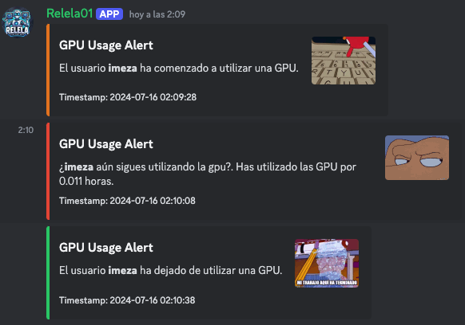

# ReLeLa Discord Bot

<p align="center"> 

</p>

A Discord bot for monitoring GPU usage and running various commands, designed to assist users in managing and tracking server resources.

## Features
The main commands to interact with the bot are listed below. Remember, each command must begin with a `!`:

- `!commands`: Show the available commands.
- `!gpustat`: Displays the status of used GPUs.
- `!runstatus`: Displays a detailed log of the codes being executed on the server.
- `!ping`: Check the bot's status.


Additionally, the bot has a feature that allows it to identify if someone is using a GPU. This feature announces the usage in Discord, notifying when someone has been using the GPU for more than X hours and when they stop using it.

<p align="center"> 

</p>


## Setup

### Prerequisites

- Python 3.7 or higher
- Discord account and bot token
- NVIDIA GPU and drivers
- `nvidia-smi` installed and accessible from the command line
- `gpustat` installed and accessible from the command line

### Environment Variables

Create a `.env` file in the root directory and add your Discord bot token and channel ID:

```env
DISCORD_TOKEN_RELELA_1=your_discord_bot_token
DISCORD_CHANNEL_1=your_discord_channel_id
```

## Running the Bot

Run the bot using the following command:

```sh
python main.py
```


<p align="center"> 

</p>